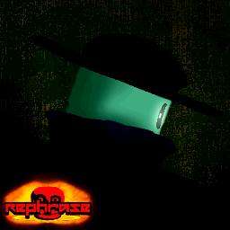

# REPHRASE

> Rephrase is an upcoming 1v10 asymmetrical horror game featuring characters from Roblox webseries and old Roblox games, Rephrase takes inspiration from Flee the Facility and Where's Garry.

## The Round

Well, to put it shortly, Rounds usually have 6 minutes because there are ALOT of tasks you have to do, you would likely have to rely on Teamwork and Helping the survivors to finish the tasks or prevent the killer from disrupting the tasks.

### Overtime

Once the time's up, you will enter something called... Overtime. Every 60 seconds, your loaction will be revealed to the enemy for 5 second. This serves as a punishment for a stubborn people who wants to lms.

## The Tasks

In every round, There's 150 tasks to do with that AMOUNT of time! Normally, the task can be collecting fire rings or cleaning up trash and destroy the fire ring symbol. HOWEVER! Keep in mind that the killer can disrupt the task to force you to start over.

## The Roles

### The Alliance

Their job is very simple, To activate the exit gate. you must complete the task depended on the map, The tasks are usually either putting out a fire or... collect fire rings. If the timer hits 0, well... it's a tie.

### The Enemy

Meanwhile, their's job is simple aswell. Prevent the survivor from completing the tasks and makes sure to disrupt them so the survivor would had to start over, But keep in mind that you can only disrupt atleast 10 tasks.

